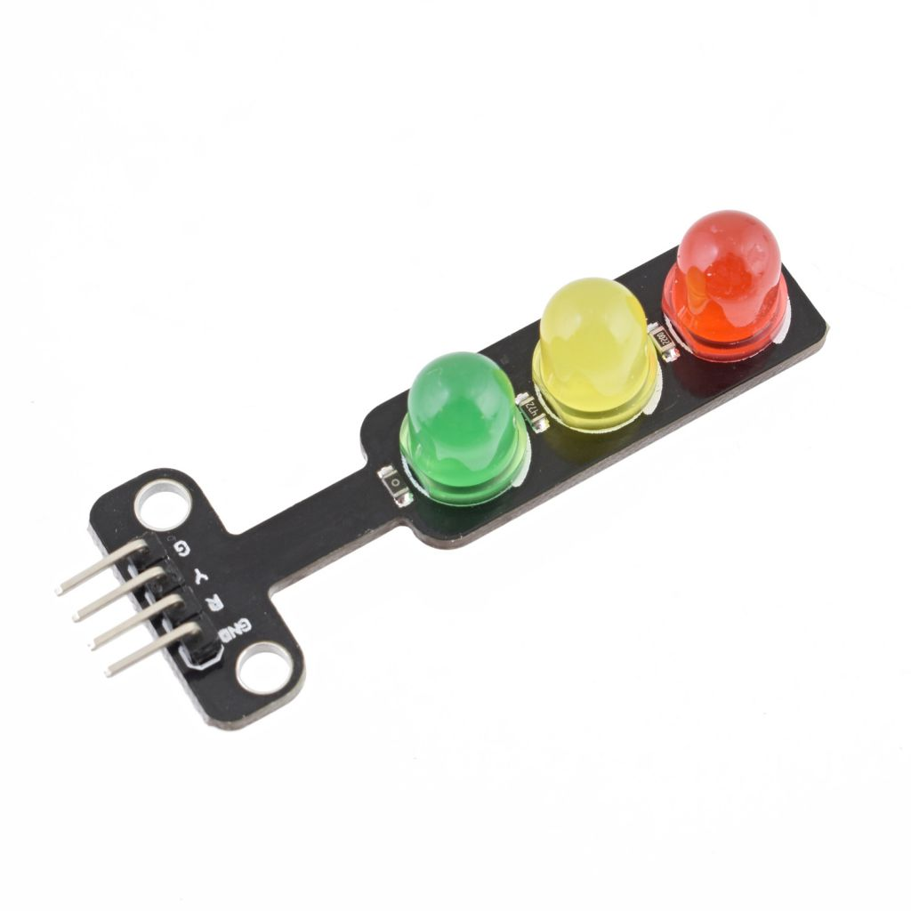
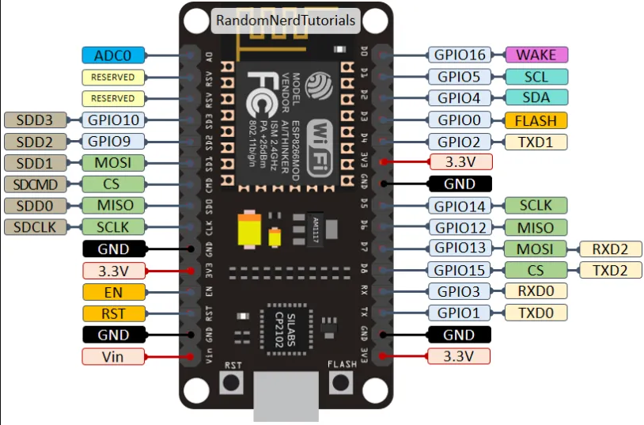

# Node MCU LED Control:

## About project

Thanks to this project I have learned how to control actuating device (LED diodes) via sending requests http.

To represent LED lights I used power of 2:

__GREEN__ = 2^0 = 1

__YELLOW__ = 2^1 = 2

__RED__ = 2^2 = 4

### Project contains:
* http server written in GO,
* client code for ESP8266 in INO = listening one endpoint, and depending on its value control LEDs

### Project features:
* control LED lights via HTTP
* logging of LED changes

### HARDRWARE PART:

#### Traffic lights LED module:

#### ESP 8266 : Pinouts

| ESP8266 PINOUT | LED MODULE |
| ------------- | :-------------:|
| GND | GND|
| D1 | R|
| D2 | Y|
| D4 | G|

### SERVER ENPOINTS:

#### __Set LED's status__:
    `http://IP:5108/led/setstatus?led=value`
    
Where:
* *IP* = your computer's IP address, where api is running
* *Value* = Integer value from 0 to 7

##### *LED Statues*:
    
| Value  | Red light | Yellow light | Green light |
| ------------- || ------------- | ------------- :-------------:|
| 0  | TURN OFF | TURN OFF  | TURN OFF  |
| 1  | TURN OFF | TURN OFF  | TURN ON  |
| 2  | TURN OFF | TURN ON  | TURN OFF  |
| 3  | TURN OFF | TURN ON  | TURN ON  |
| 4  | TURN ON | TURN OFF  | TURN OFF  |
| 5  | TURN ON | TURN OFF  | TURN ON  |
| 6  | TURN ON | TURN ON  | TURN OFF  |
| 7  | TURN ON | TURN ON  | TURN ON  |

#### __Check LED's status__:
`http://IP:5108/led/checkstatus`

Return: integer value which representing LEDs turn on status (*see table above*)

### RUN PROJECT INSTRUCTION:
1. RUN server:
    1. go to `web` folder
    2. use command `go run .`
2. ESP8266:
    1. use Arduino IDE to edit code: edit `SSID` and `password`
    2. connect LED module to ESP8266 in the right way
    3. upload code to your ESP via Arduino IDE
3. TEST:
    1. Send request via Postman to endpoint: `/led/setstatus?led=`
    2. Observe change on LED lights

